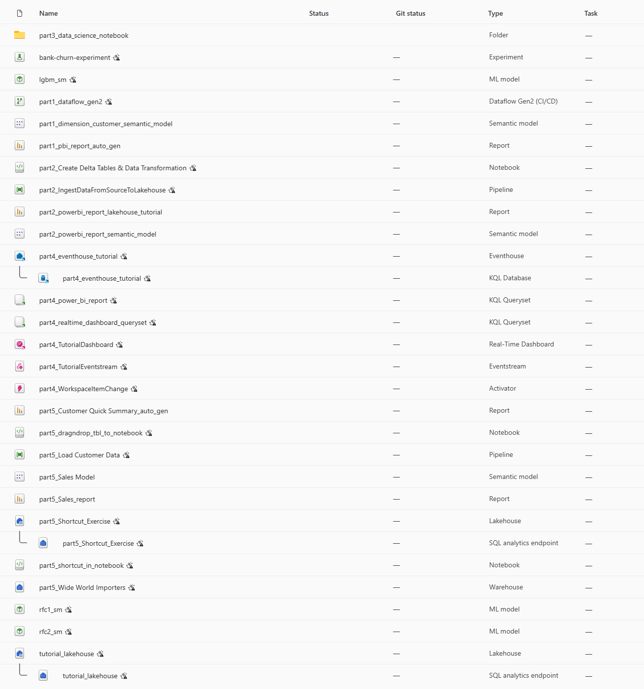

# 🚀 Microsoft Fabric

This repository demonstrates how resources are created in a Git repository when Git integration is activated with a Fabric workspace created by following the E2E tutorials.

> [!TIP]
> A workspace admin can connect a workspace to a Git repository. Using these resources can simplify resource creation in the end-to-end tutorial by minimizing manual steps.

## 📚 Documentation and Tutorial

- [Microsoft Fabric portal](https://app.fabric.microsoft.com/)
- [Documentation](https://learn.microsoft.com/en-us/fabric/)
- [End to end tutorials](https://learn.microsoft.com/en-us/fabric/fundamentals/end-to-end-tutorials) > [Docs](https://github.com/MicrosoftDocs/fabric-docs/blob/main/docs/fundamentals/end-to-end-tutorials.md)  
- [Fabric samples](https://github.com/microsoft/fabric-samples): GitHub repository for Fabric samples
- [Microsoft Fabric Git integration?](https://learn.microsoft.com/en-us/fabric/cicd/git-integration/intro-to-git-integration)

## 📋 Resource Description

### 1. 🎯 Hands-on by end to end tutorials 

- **Part 1: Lakehouse** 🌊
    - part 1 prefixed assets: Dataflow -> Semantic model -> Power BI
- **Part 2: Lakehouse** 🌊
    - part 2 prefixed assets: Data Pipeline -> Notebook -> Semantic model -> Power BI
- **Part 3: Data science** 💙
    - Random Forest (Bagging (parallel ensemble)), LightGBM (Gradient Boosting (sequential ensemble))
    - bank-churn-experiment
    - lgbm_sm
    - rfc1_sm
    - rfc2_sm
- **Part 4: Real-Time Intelligence** ⚡
    - part 4 prefixed assets: Eventhouse -> Eventstream -> KQL -> Realtime Dashboard
- **Part 5: Data warehouse** 🪣
    - part 5 prefixed assets: Data warehouse -> Data Pipeline -> SQL (Incl. Visual Query) & Notebook -> Semantic model -> Power BI Report
- **Dataset** 🗂️
    - part 1: dimension_customer.csv: `Copy permalink` from [the official sample repository](https://github.com/microsoft/fabric-samples/blob/main/docs-samples/data-engineering/dimension_customer.csv) or see the `dataset` directory. 
    - part 2: Import parquet files from https://fabrictutorialdata.blob.core.windows.net/sampledata/ using Data Pipeline. `Check the details in the tutorial`.
    - part 3: bankcustomer_churn.csv: see the `dataset` directory
    - part 4: Use the sample data provided by Fabric by default (Bicycle rentals)
    - part 5: Import parquet files from https://fabrictutorialdata.blob.core.windows.net/sampledata/ using Data Pipeline. `Check the details in the tutorial`.
        - https://fabrictutorialdata.blob.core.windows.net/sampledata/WideWorldImportersDW/tables/fact_sale.parquet
        - https://fabrictutorialdata.blob.core.windows.net/sampledata/WideWorldImportersDW/tables/dimension_city.parquet

### 2. 📝 Supplement

- Semantic Link
    - Semantic Link all-in-one demo.ipynb

### 3. ⚙️ Environment setup

- Fabric stores metadata only. Actual data (OneLake files, table contents) and connection secrets/credentials are not stored in Git. After a fresh sync/clone into another workspace, you'll typically need to recreate or rebind connections and re-enter credentials.
- [Manually fix a failed update](https://learn.microsoft.com/en-us/fabric/cicd/git-integration/partial-update)

#### Trouble shooting

Troubleshooting GitHub sync issues, especially when syncing data to another tenant.

1. Set the value to null to resolve the “connection not found” issue during synchronization with the GitHub repository.

    - part2_IngestDataFromSourceToLakehouse.DataPipeline/pipeline-content.json
    - part5_Load Customer Data.DataPipeline/pipeline-content.json

    ```json
    "externalReferences": {
        "connection": ""
    },
    ```

2.  The email address in the Fabric Event Alert Tutorial should be replaced with your own email address. The placeholder is set to `test@email.com`.

    - part4_WorkspaceItemChange.Reflex/ReflexEntities.json

    ```json
    "definition": {
    "type": "Rule",
    "instance": "..test@email.com.."
    ```

    Set your tenant id and workspace id in the json.

    ```json
    "tenantId": "...", // Get this from Azure Portal
    "workspaceId": "..." // Get from your Microsoft Fabric URL. https://app.fabric.microsoft.com/groups/YOUR_WORKSPACE_ID
    ```

3. Recreate connection for DataPipeline

   - part2_IngestDataFromSourceToLakehouse.DataPipeline: see this [tutorial](https://learn.microsoft.com/en-us/fabric/data-engineering/tutorial-lakehouse-data-ingestion)
   - part5_Load Customer Data.DataPipeline: see this [tutorial](https://learn.microsoft.com/en-us/fabric/data-warehouse/tutorial-ingest-data)

#### Resource list


